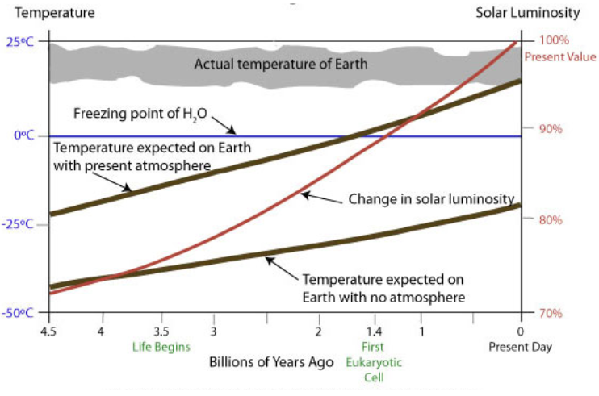

# The Faint Young Sun Paradox: An Ancient Climate Mystery
#### Written by Luc Gauthier, Megan Groshok, Lauren Mutton, Leah Smith
*iSci 3A12 Climate Change, Fall 2022*

## The Faint Young Sun Paradox
The Faint Young Sun Paradox (FYSP) is one of the largest problems in paleoclimatology, which was discovered by Carl Sagan and George Mullen in 1972. Based on mathematical models, it has been determined that early Earth’s surface temperature must have been below the freezing point of sea water (Figure 1). However, geological and fossil evidence prove that liquid water existed at this time, leading to the paradox (Sagan and Mullen, 1972).

### Figure 1: The Faint Young Sun paradox

*Figure 1: Standard solar models show when the Earth formed, the Sun was only at 70% of its present luminosity (red line), and thus the Earth was much colder. Whether the Earth had the same atmosphere as at present, or no atmosphere (brown lines), the temperature would have been significantly below the freezing point of water (blue line) for several billion years. However, the evolution of life during this time indicates that this was not the case and the actual temperature of the Earth was much higher. This problem makes up the Faint Young Sun Paradox (Learner.org, 2019).*

## Potential solutions
There are numerous theories that have been proposed to resolve the FYSP. The most popular theory is the greenhouse effect, a natural process that traps heat in the atmosphere, warming Earth’s surface (University Corporation for Atmospheric Research, n.d.). These theories suggest different mechanisms that would allow higher atmospheric CO2, keeping the Earth from freezing (Ruddiman, 2014).

### Chemical weathering
Chemical weathering is a method of carbon sequestration (capture, removal, and storage) that’s influenced by factors like temperature and precipitation (Ruddiman, 2014). Weathering is a negative feedback that is decreased by cold, dry environments, which reduces sequestration and will increase warming.

### Early Biological Carbon Sequestration
The early evolution of life induces biological sequestration, which may be accountable for the differences between past and present atmospheric carbon dioxide levels. Plants regulate atmospheric carbon dioxide through photosynthesis and respiration, which allows them to remove human-caused carbon emissions from the environment (Le Quéré et al., 2016; Keenan and Williams, 2018).

### Moon tidal heating
The moon could have had a tidal heating effect on the early Earth (Heller et al., 2021). Due to the differences in gravitational forces (angular momentum of the Earth and the Moon) the Moon caused friction within the early Earth, causing the release of heat.

### Solar mass loss
The Sun constantly loses mass, but if these rates were higher in the past, then the Sun may have been large enough to raise the Earth’s temperature and resolve the paradox (Minton and Malhotra, 2007). However, analysis of comparable stars suggests that mass loss could not have occurred at this scale.

### Cloud coverage
Cloud coverage has two primary effects that influence planetary temperature. Low-lying clouds reflect solar radiation, which increases the Earth’s albedo (reflectivity) and decreases temperature. In contrast, heat can be absorbed by clouds, thus increasing temperature (Goldblatt and Zahnle, 2011; Güdel, 2014). The temperature regulation resulting from these mechanisms is not sufficient in resolving the paradox.

## Discussion
The FYSP also applies to other planets. On Mars, the FYSP is more pronounced due to its distance from the Sun (Minton and Malhotra, 2007; Martens, 2017). Many theories have been proposed, with the most likely being that subglacial melting produced river networks (Heydari et al., 2020) while meteorite activity melted the surfaces of glaciers and created a temporary greenhouse effect, allowing precipitation (Kaufman, 2020). By studying Venus, possible solutions to the FYSP can be identified. Some of these solutions include cloud coverage concentrations (Turbet et al., 2021) and the greenhouse gas effect (Taylor, Svedhem and Head, 2018) , which are observable in extremes on Venus. Most of these theories are limited by lack of physical evidence as they are based on simulations and models, making it diffcult to confirm or deny their validity.

## Conclusion
Overall, the FYSP is a complicated topic that has not been fully resolved. While current solution methods have been proposed, more research must be performed to determine a more precise resolution.

## Works cited

Goldblatt, C. and Zahnle, K.J., 2011. Clouds and the Faint Young Sun Paradox. *Climate of the Past*, 7(1), pp.203–220. https://doi.org/10.5194/cp-7-203-2011.

Güdel, M., 2014. Faint Young Sun Paradox. In: R. Amils, M. Gargaud, J. Cernicharo Quintanilla, H.J. Cleaves, W.M. Irvine, D. Pinti and M. Viso, eds. *Encyclopedia of Astrobiology*. [online] Berlin, Heidelberg: Springer. pp.1–7. https://doi.org/10.1007/978-3-642-27833-4_1700-5.

Heller, R., Duda, J.-P., Winkler, M., Reitner, J. and Gizon, L., 2021. Habitability of the early Earth: liquid water under a faint young Sun facilitated by strong tidal heating due to a closer Moon. *PalZ*, 95(4), pp.563–575. https://doi.org/10.1007/s12542-021-00582-7.

Heydari, E., Schroeder, J.F., Calef, F.J., Van Beek, J., Rowland, S.K., Parker, T.J. and Fairén, A.G., 2020. Deposits from giant floods in Gale crater and their implications for the climate of early Mars. *Scientific Reports*, [online] 10(1). https://doi.org/10.1038/s41598-020-75665-7.

Keenan, T.F. and Williams, C.A., 2018. The Terrestrial Carbon Sink. *Annual Review of Environment and Resources*, 43(1), pp.219–243. https://doi.org/10.1146/annurev-environ-102017-030204.   
  
Le Quéré, C., Andrew, R.M., Canadell, J.G., Sitch, S., Korsbakken, J.I., Peters, G.P., Manning, A.C., Boden, T.A., Tans, P.P., Houghton, R.A., Keeling, R.F., Alin, S., Andrews, O.D., Anthoni, P., Barbero, L., Bopp, L., Chevallier, F., Chini, L.P., Ciais, P., Currie, K., Delire, C., Doney, S.C., Friedlingstein, P., Gkritzalis, T., Harris, I., Hauck, J., Haverd, V., Hoppema, M., Klein Goldewijk, K., Jain, A.K., Kato, E., Körtzinger, A., Landschützer, P., Lefèvre, N., Lenton, A., Lienert, S., Lombardozzi, D., Melton, J.R., Metzl, N., Millero, F., Monteiro, P.M.S., Munro, D.R., Nabel, J.E.M.S., Nakaoka, S., O’Brien, K., Olsen, A., Omar, A.M., Ono, T., Pierrot, D., Poulter, B., Rödenbeck, C., Salisbury, J., Schuster, U., Schwinger, J., Séférian, R., Skjelvan, I., Stocker, B.D., Sutton, A.J., Takahashi, T., Tian, H., Tilbrook, B., van der Laan-Luijkx, I.T., van der Werf, G.R., Viovy, N., Walker, A.P., Wiltshire, A.J. and Zaehle, S., 2016. Global Carbon Budget 2016. *Earth System Science Data*, 8(2), pp.605–649. https://doi.org/10.5194/essd-8-605-2016.

Learner.org, 2019. Unit 1: Many Planets, One Earth. In: *The Habitable Planet*. [online] Available at: <https://www.learner.org/wp-content/uploads/2019/01/unit1.pdf>. 
  
Martens, P.C., 2016. The Faint Young Sun and Faint Young Stars Paradox. *Proceedings of the International Astronomical Union*, 12(328), pp.350–355. https://doi.org/10.1017/S1743921317004331.

Minton, D.A. and Malhotra, R., 2007. Assessing the Massive Young Sun Hypothesis to Solve the Warm Young Earth Puzzle. *The Astrophysical Journal*, 660(2), pp.1700–1706. https://doi.org/10.1086/514331.

Ruddiman, W.F., 2014. *Earth’s Climate: Past and Present*. Third Edition ed. New York: W. H. Freeman and Company.

Sagan, C. and Mullen, G., 1972. Earth and Mars: Evolution of Atmospheres and Surface Temperatures. *Science*, 177(4043), pp.52–56. https://doi.org/10.1126/science.177.4043.52.

Taylor, F.W., Svedhem, H. and Head, J.W., 2018. Venus: The Atmosphere, Climate, Surface, Interior and Near-Space Environment of an Earth-Like Planet. *Space Science Reviews*, 214(1), p.35. https://doi.org/10.1007/s11214-018-0467-8.

Turbet, M., Bolmont, E., Chaverot, G., Ehrenreich, D., Leconte, J. and Marcq, E., 2021. Day–night cloud asymmetry prevents early oceans on Venus but not on Earth. *Nature*, 598(7880), pp.276–280. https://doi.org/10.1038/s41586-021-03873-w.
  
University Corporation for Atmospheric Research, 2022. *The Greenhouse Effect*. [online] UCAR: Center for Science Education. Available at: <https://scied.ucar.edu/learning-zone/how-climate-works/greenhouse-effect> [Accessed 14 November 2022].
